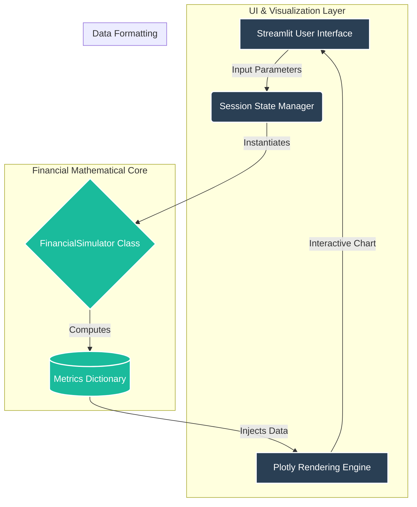

# FPA-Scenario-Modeling-Engine
**Enterprise-Grade Dynamic P&L Simulator & Financial What-If Analysis Engine**

## **1. Executive Summary**
The **FPA-Scenario-Modeling-Engine** is a deterministic financial modeling application designed for Financial Planning and Analysis (FP&A) teams. It provides a real-time "What-If" scenario environment to simulate the impact of market volatility, pricing strategies, and cost-structure adjustments on overall corporate profitability. 

Unlike static spreadsheet models, this engine utilizes a Python-backed object-oriented mathematical core to compute unit economics, gross margins, and Net Profit (P&L) instantaneously, rendering the outputs through an advanced, dynamic visualization layer.

## **2. Business Value & Use Cases**
* **Pricing Strategy Optimization:** Evaluate how adjustments in unit pricing impact gross revenue versus variable cost scaling.
* **Break-Even Analysis:** Dynamically model the intersection of fixed administrative costs and variable operational costs against projected sales volumes.
* **Margin Sensitivity:** Isolate and stress-test specific financial parameters to determine their isolated impact on the final profit margin percentage.
* **Board-Ready Reporting:** Generate real-time, interactive Waterfall charts that visually explain the bridge between gross revenue and net profit to stakeholders.

## **3. High-Level System Architecture**

The repository enforces strict **Clean Architecture** principles, aggressively decoupling the underlying mathematical business logic from the user interface presentation layer.


## **4. Core Technical Features**
##### **4.1. Object-Oriented Mathematical Engine (`core/finance_math.py`)**
* **Strict Type Hinting:** Fully typed methods (`-> float, -> dict`) to ensure data integrity and prevent downstream UI rendering failures.

* **Encapsulation:** Financial logic (revenue aggregation, cost distribution, margin calculation) is isolated within the `FinancialSimulator` class.

* **Enterprise Logging:** Implementation of the standard Python `logging` library to track initialization, parameters, and computation sequences for observability.

##### **4.2. Presentation & Rendering Layer `(dashboard.py)`**
* **Dynamic UI Rendering:** Built on Streamlit to provide immediate graphical feedback upon parameter mutation.

* **Advanced Plotly Integration:** Implementation of customized Waterfall Charts (`go.Waterfall`) to visualize the P&L bridge.

* **Responsive Axis Scaling:** The rendering function calculates dynamic headroom (`y_max_range = metrics['revenue'] * 1.20`) and disables clip-on-axis to ensure data labels are never truncated, regardless of extreme scenario volatility.

## **5. Repository Structure**

```text
FPA-Scenario-Modeling-Engine/
│
├── core/
│   └── finance_math.py         # OOP mathematical core and P&L logic
│
├── dashboard.py                # Streamlit presentation layer and UI routing
├── requirements.txt            # Dependency manifest (Streamlit, Plotly, Pandas)
├── .gitignore                  # Ignored files and cache configuration
└── README.md                   # Architectural documentation
```

## **6. Installation & Deployment**
This application is designed to run in isolated virtual environments to prevent dependency conflicts.

##### **Step 1: Clone the repository**

```
git clone [https://github.com/alejandro-javier-ds/FPA-Scenario-Modeling-Engine.git](https://github.com/alejandro-javier-ds/FPA-Scenario-Modeling-Engine.git)
cd FPA-Scenario-Modeling-Engine
```

##### **Step 2: Create and activate a virtual environment**

```
python -m venv venv
source venv/bin/activate  # On Windows use: venv\Scripts\activate
```

##### **Step 3: Install core dependencies**

```
pip install -r requirements.txt
```

##### **Step 4: Initialize the Simulation Engine**
```
streamlit run dashboard.py
```

## **7. Future Enhancements (Roadmap)**
* **Stochastic Modeling:** Integration of `numpy.random` to transition from deterministic modeling to full Monte Carlo simulations for risk probability distribution.

* **Historical Data Ingestion:** Connect the engine to a SQL database via SQLAlchemy to establish baseline parameters based on actual YTD (Year-to-Date) financial performance.

* **PDF Report Generation:** Implement automated PDF compilation for immediate distribution of scenario results to executive stakeholders.