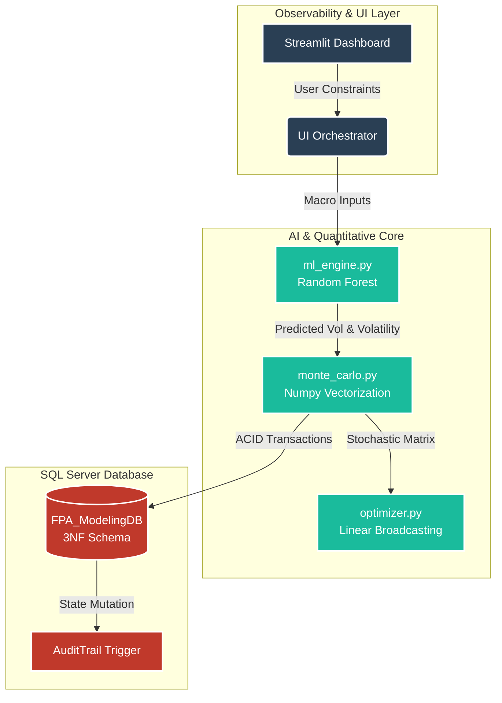

# **Quantitative Financial AI Engine & Stochastic Risk Optimizer**

<div align="left">
  
  
  
  
  
</div>

---

## **1. Executive Summary**
The **Quantitative Financial AI Engine** is an end-to-end Enterprise-grade Data Science platform designed to eliminate human cognitive bias in corporate asset allocation and pricing strategy. Evolving beyond static, deterministic spreadsheet models, this system architectures a non-parametric Machine Learning pipeline that feeds into a highly parallelized Monte Carlo Simulation Engine. 

By leveraging multidimensional linear broadcasting and an ACID-compliant SQL Server backend, the platform evaluates millions of statistical realities concurrently, isolating the absolute mathematical efficient frontier to prescribe optimal business decisions.

## **2. Business Value & Core Use Cases**
* **Autonomous Pricing Optimization (Prescriptive):** Replaces trial-and-error forecasting by algorithmically testing hundreds of price points against millions of simulated futures to dictate the exact price that maximizes P50 gross profit while respecting strict executive risk limits.
* **Algorithmic Bias Elimination (Machine Learning):** Prevents analysts from manually entering optimistic sales volumes. A Random Forest model evaluates macroeconomic inputs (Inflation, Marketing, Competitor Pricing) to mathematically predict baseline volumes and market volatilities.
* **Mathematical Risk Quantification (Stochastic):** Moves beyond "best/worst-case" scenarios by simulating 10,000 distinct financial realities per strategy, returning the exact probability percentage of taking a financial loss.
* **Institutional Data Governance (Data Engineering):** Maintains an immutable Single Source of Truth via a 3NF normalized SQL database, protected by internal triggers and audit trails for compliance.

## **3. Technology Stack & Core Libraries**
* **Backend Core:** Python 3.9+
* **Data Persistence:** Microsoft SQL Server, PyODBC (ACID Transactions)
* **Intelligence & ML:** `scikit-learn` (Random Forest Regression)
* **Quantitative Math:** `numpy` (C-Array Matrix Vectorization)
* **Frontend & Visualization:** `streamlit`, `plotly` (Dynamic Dual-Axis Rendering)
* **Data Manipulation:** `pandas` (ETL & DataFrame Pipeline)

## **4. High-Level System Architecture**
The repository enforces strict **Single Responsibility Principle (SRP)** and **Clean Architecture**, completely decoupling the presentation interface from the algorithmic engines and the database layer.



## **5. Database Architecture & Data Integrity**
Data permanence is managed via a rigorously normalized schema compliant with the Third Normal Form (3NF). The system is stress-tested to support massive transactional loads (100,000+ continuous record insertions).

* **`FinancialScenarios:`** Core indexing and categorical metadata.

* **`ScenarioParameters:`** Deterministic boundary tracking and inputs.

* **`QuantitativeMetrics:`** Probabilistic payload results mapping the simulated Gaussian distribution (P10, P50, P90, Risk Probability).

* **`AuditTrail:`** Automated state-tracking table populated by an AFTER UPDATE SQL Trigger that catches and logs any historical mutations to enforce corporate accountability.

## **6. Core Quantitative & AI Modules**
The mathematical intelligence of the system is strictly decoupled into three specialized engines:

#### 1. `ml_engine.py` **(Predictive):**
Utilizes a Random Forest Regressor to map non-linear relationships.

$$Y_{volume, volatility} = f(X_{inflation}, X_{marketing}, X_{competitor\_price}) + \epsilon$$

#### 2. `monte_carlo.py` **(Stochastic Risk):**
Calculates 10,000 distinct realities utilizing NumPy's C-array vectorization, extracting inverse
CDF properties without traditional `for-loops` to prevent hardware bottlenecks.

$$Risk\_Probability = \left(\frac{\sum(Gross\_Profit < 0)}{10{,}000}\right) \times 100$$

#### 3. `optimizer.py` **(Prescriptive):**
Executes a parallelized algorithmic scan that maps mathematical risk tolerances to optimize exact yield returns, filtering a 100-price vector array against the 10,000-deep simulated universe in milliseconds.

## **7. Advanced SQL Analytics Capabilities**
The underlying database is structured to support complex Data Science querying, including:

* **Window Functions:** Ranking and partitioning scenario profitability grouped by specific strategists or regions.
* **Statistical Aggregations:** Isolating moving variances between optimistic (P90) and pessimistic (P10) distributions to detect structural inefficiencies.
* **Multi-Table Joins:** Creating flat analytical landscapes ready for immediate downstream secondary Machine Learning ingestion.

## **8. Repository Structure**
```plaintext
FPA-Scenario-Modeling-Engine/
|
├── core/
│   ├── __init__.py
│   ├── ml_engine.py          # Random Forest prediction model
│   ├── monte_carlo.py        # Vectorized stochastic simulation
│   └── optimizer.py          # Prescriptive pricing algorithm
|
├── db/
│   ├── __init__.py
│   ├── database_manager.py   # PyODBC connection and CRUD operations
│   └── FPA_ModelingDB.sql    # DDL Schema and Trigger definitions
|
├── dashboard.py              # Streamlit presentation and Plotly routing
├── seed_database.py          # Mass-concurrency data generation script
├── requirements.txt          # Frozen dependency manifest
├── .gitignore                # Ignored environment and cache configurations
└── README.md                 # Systems Architecture Documentation
```

## **9. Installation & Deployment**
This application requires an active SQL Server instance and a controlled Python virtual environment.

#### **Step 1: Clone the repository and setup the environment**
```bash
git clone https://github.com/your-username/FPA-Scenario-Modeling-Engine.git
cd FPA-Scenario-Modeling-Engine
python -m venv venv
source venv/bin/activate  # On Windows: venv\Scripts\activate
```

#### **Step 2: Install core dependencies**
```bash
pip install -r requirements.txt
```

#### **Step 3: Database Initialization**
Execute the scripts found in `db/FPA_ModelingDB.sql` within SQL Server Management Studio (SSMS) to build the 3NF schema and the auditing triggers.

#### **Step 4: Populate the Data Lake**
Run the seeding script to generate synthetic historical data and stress-test the SQL transacting layer (Simulates 100,000 scenarios).
```bash
python seed_database.py
```

#### **Step 5: Launch the Enterprise AI Dashboard**
```bash
streamlit run dashboard.py
```